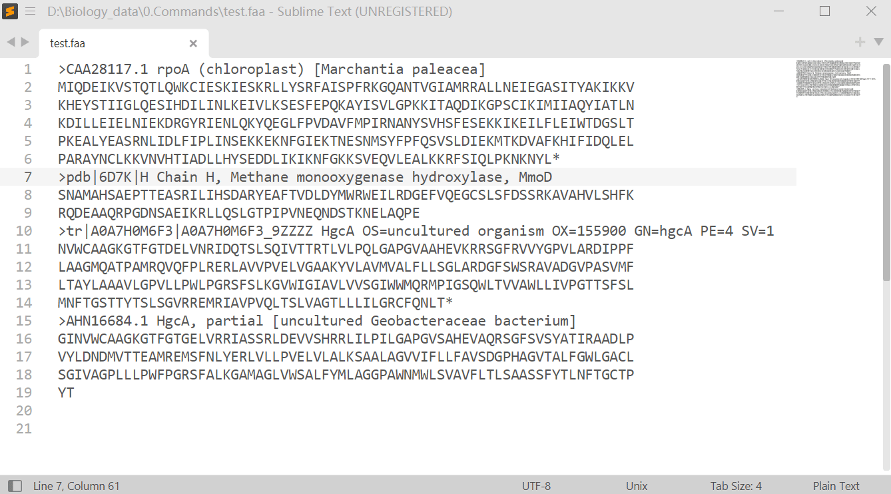
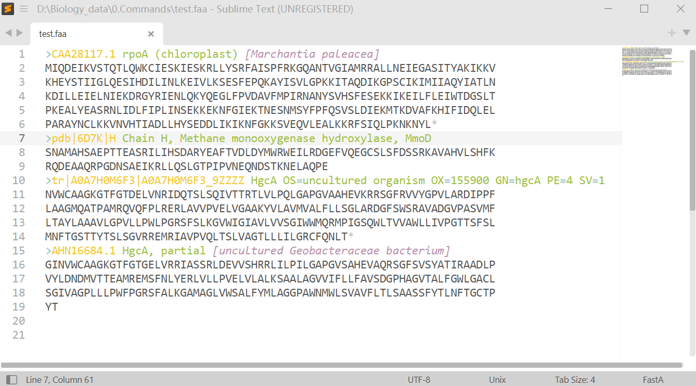
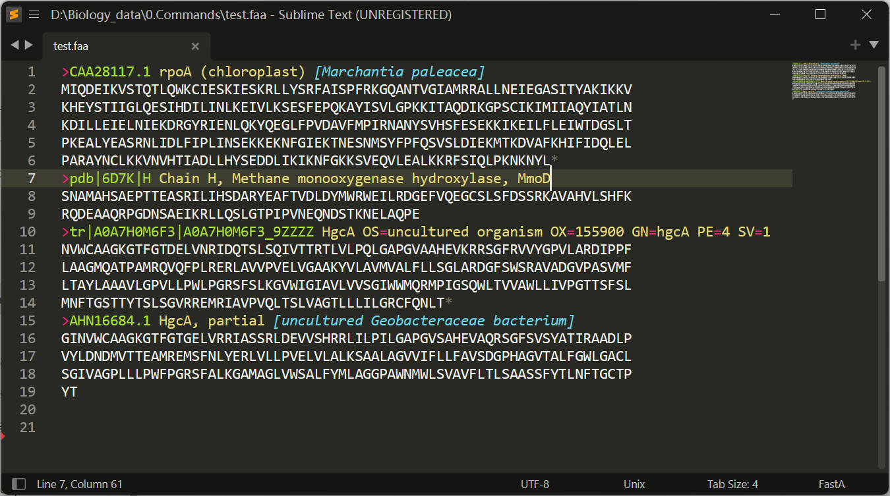
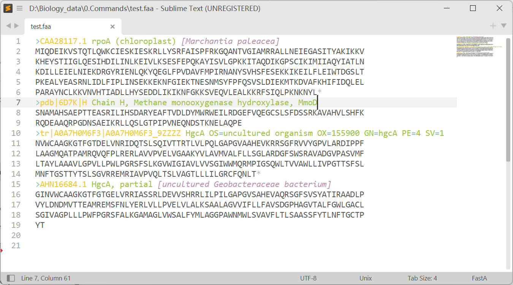
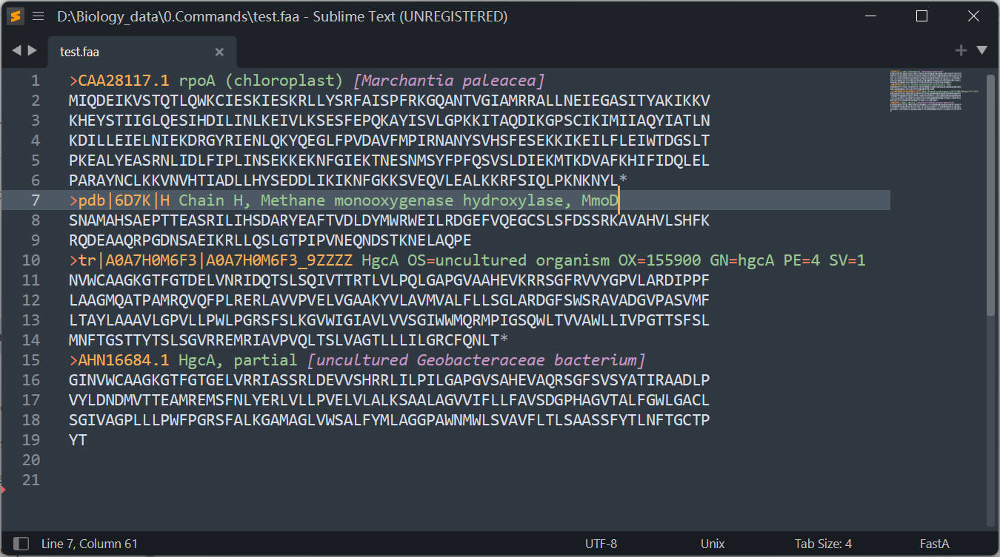
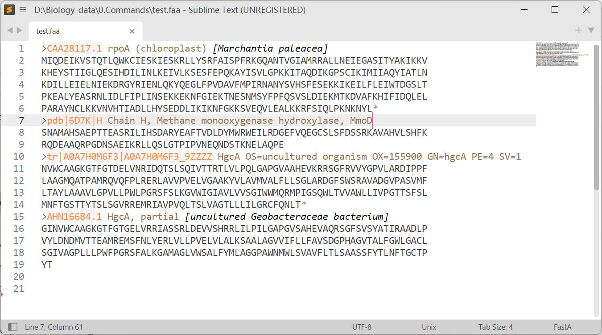

# sublime-fasta-syntax
Let [Sublime Text](https://www.sublimetext.com/) know better of [FastA format](https://www.ncbi.nlm.nih.gov/genbank/fastaformat/).

`FastA` format is a commonly used text-based format for representing biological sequence data, such as DNA or protein sequences. It consists of a single-line sequence header, which begins with a `>` character, followed by one or more lines of sequence data. The header typically contains information about the sequence, such as its name or source organism. FastA format is widely supported by bioinformatics software and databases, and is often used for tasks such as sequence alignment and database searching.

## Installation

**Tested on Sublime Text 4**

### Download the syntax file
Download the `fasta.sublime-syntax` and put it in the Sublime Text user folder:
- Windows: `%APPDATA%\Sublime Text\Packages\User`
- Mac: `~/Library/Application Support/Sublime Text/Packages/User`
- Linux: `~/.config/sublime-text/Packages/User`

### Applying syntax
The application should recognize files in extention `fa`, `fasta`, `faa`, or `fna` automatically.

If the syntax is not applied automatically accidentally, you can specify the syntax by either:
- click menu -> View -> Syntax -> FastA
- click 'plain text' at the bottom right -> FastA

## Note
This is a `Syntax` which helps Sublime Text understand the composition of the FastA format, not a `Theme` or a `Color Scheme`. The color of the key words is specified according to the `Color Scheme` which you can select by `menu -> Preferences -> Select Color Scheme...`

## Samples
A few examples of this syntax working with severl built-in color schemes:
1. Monokai

2. Sixteen

3. Mariana

4. Celeste

